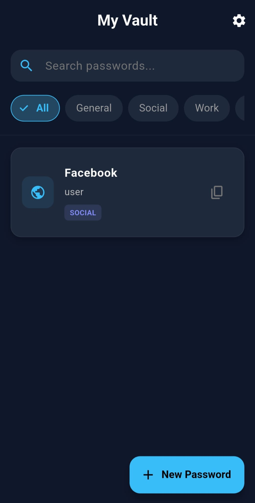
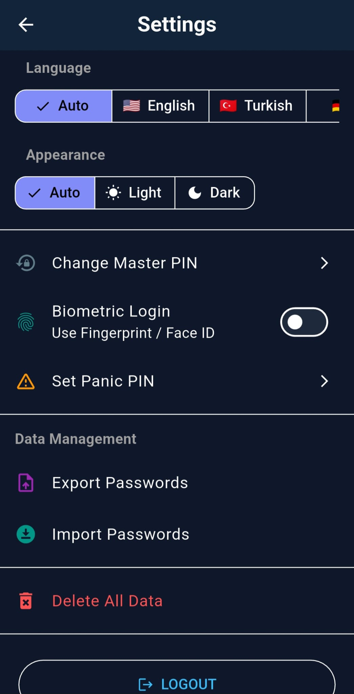
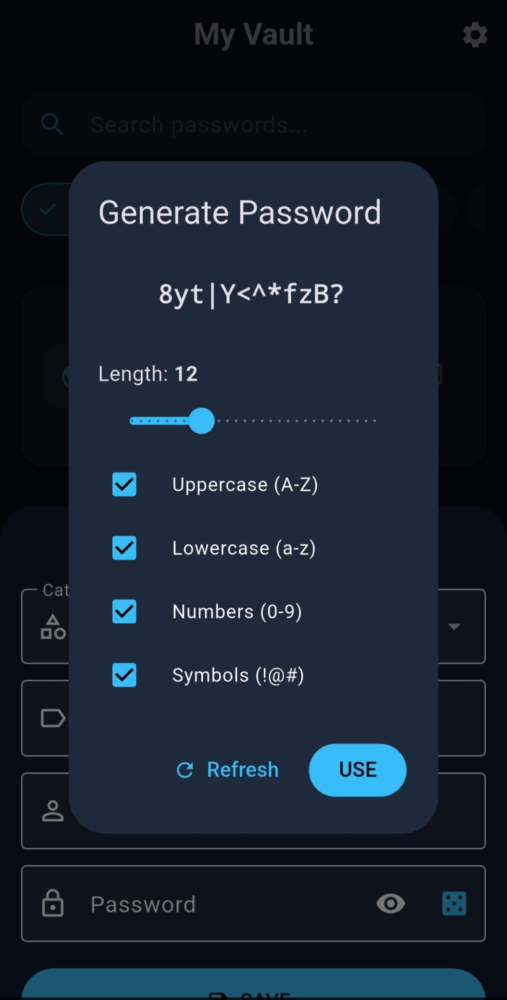

# 🛡️ OneRule - Offline-First & Secure Password Manager

OneRule is a secure, modern, and completely offline password manager built with Flutter. Your data never leaves your device.


## 🚀 Features

* **100% Offline:** The app requests NO internet permission (`android.permission.INTERNET`). Your data is never sent to the cloud.
* **Military-Grade Encryption:** All data is encrypted with **AES-256** standard within the Hive database.
* **Master PIN & Biometric Login:** Quick and secure access via a 6-digit Master PIN or fingerprint/face ID.
* **🚨 Panic Mode:** Set a specific "Panic PIN". If entered under duress, the vault appears empty to protect your real data.
* **Secure Storage:** Encryption keys are derived using PBKDF2 and stored securely within the device's hardware-backed Keystore (`flutter_secure_storage`).
* **Screen Shield:** Prevents screenshots and blurs the app content when in the background or multitasking view.
* **Backup & Restore:** Securely export your encrypted database to a JSON file and transfer it to another device.
* **Categorization:** Organize your passwords into categories like Work, Social, Finance, etc.
* **Multi-Language Support:** Available in English 🇺🇸, Turkish 🇹🇷, and German 🇩🇪.

## 🛠️ Tech Stack

* **Framework:** Flutter (Dart)
* **State Management:** Provider
* **Database:** Hive (AES-256 Encrypted Box)
* **Security:**
    * `flutter_secure_storage`: Secure storage for sensitive keys.
    * `local_auth`: Biometric authentication.
    * `cryptography`: PBKDF2 key derivation and secure random number generation.
    * `screen_protector`: Prevention of data leakage via screenshots/screen recording.
* **Architecture:** Facade Pattern (Clean separation of UI and Business Logic).

## 🔒 Security Architecture

OneRule takes security seriously:

1.  **Key Derivation:** Your Master PIN is combined with a random Salt and passed through **PBKDF2** (200,000 iterations) to derive the encryption key.
2.  **Memory Hygiene:** Sensitive data (like PINs and passwords) are cleared from memory (`RAM`) immediately after use.
3.  **Leakage Prevention:** Android's `allowBackup="false"` is set to prevent ADB backups and automatic Google Drive backups of the encrypted container.

## 📸 Screenshots

## 📸 Screenshots

| Vault (Home) | Settings | Generate Password
| :---: | :---: | :---: |
|  |  |  |


## 🏁 Installation & Running

To run the project locally:

1.  **Clone the repository:**
    ```bash
    git clone [https://github.com/yourusername/onerule.git](https://github.com/yourusername/onerule.git)
    cd onerule
    ```

2.  **Install dependencies:**
    ```bash
    flutter pub get
    ```

3.  **Generate Localization files:**
    ```bash
    flutter gen-l10n
    ```

4.  **Run the app:**
    ```bash
    flutter run
    ```

## ⚠️ Important Notes

* **Never Forget Your Master PIN:** Since your data is encrypted using this PIN, if you forget it, **no one** (including us) can recover your data.
* **Panic Mode:** If you set a Panic PIN in settings, entering this PIN at login will unlock a decoy vault (empty), keeping your actual data hidden.

## 🤝 Contributing

Bug reports and Pull Requests are welcome. For major changes, please open an issue first to discuss what you would like to change.

## 📄 License

This project is licensed under the [MIT](LICENSE) License.